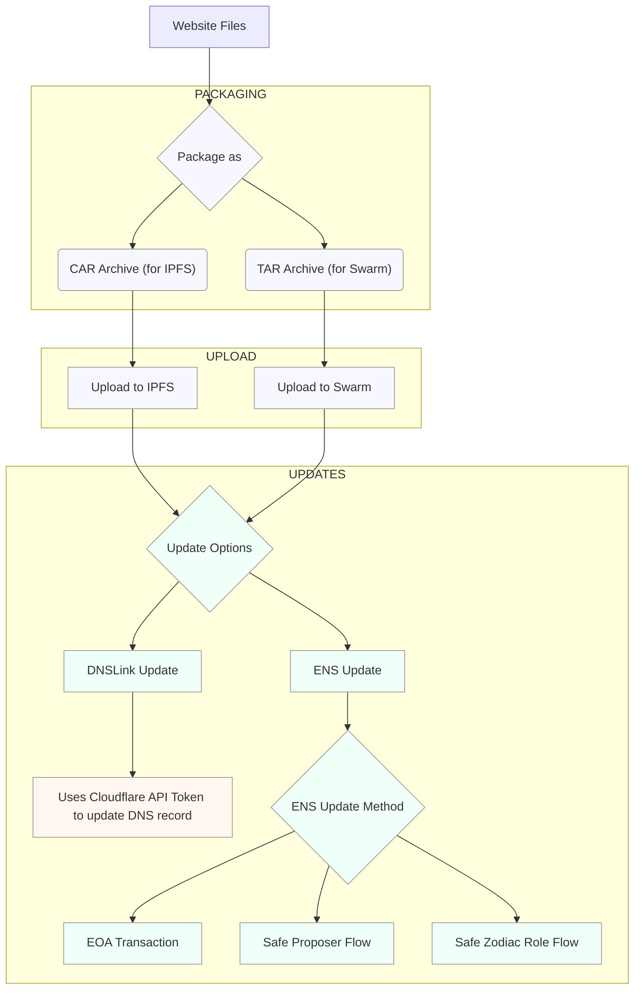

# How it works

Omnipin combines multiple technologies to provide the most secure, flexible and resilient website deployment tool. Omnipin's design is modular and allows plugging multiple protocols together, depending on specific needs.



## Re-pinning

The primary feature is uploading and re-pinning to multiple decentralized storage providers.

Since content on IPFS and Swarm has deterministic immutable hashes, it is possible to seamlessly replicate content (in a form of files or a DAG) into as many copies as possible. The reason why you would want to replicate content is to provide a fallback in case the first provider fails or does not have certain chunks of the new website version, while it is able to serve pre-existing chunks.

Omnipin scans the environment for provided API keys and tokens for storage providers, but is also possible to specify providers manually.

```sh
omnipin deploy --providers Storacha,Lighthouse
```

```jsonc
// Example provider list for an IPFS-hosted website
[
  {
    "ID": "QmUA9D3H7HeCYsirB3KmPSvZh3dNXMZas6Lwgr4fv1HTTp",
    "Addrs": [
      "/dns/dag.w3s.link/tcp/443/https"
    ],
    "Source": "IPNI"
  },
  {
    "ID": "12D3KooWNy17sJ97GTcTYRsbrp9qA19EDNGMaRFAFuJfa9NX9woq",
    "Addrs": [
      "/ip4/51.79.228.206/udp/25594/quic-v1",
      "/ip4/51.79.228.206/tcp/4000"
    ],
    "Source": "Amino DHT"
  }
]
```

## ENS Updates

In order to not have to type a full IPFS hash to open a website, as well as improve SEO, UX and have a transparent on-chain history of website updates, Omnipin integrates with ENS. It is an Ethereum-based alternative to DNS and it is possible to use ENS for serving websites. ENS has a special record type called [`contentHash`](https://docs.ens.domains/ensip/7). It contains an encoded hash which includes such information as the protocol version, codec data and the content hash itself, usually an IPFS CID.

Omnipin has multiple ways of updating ENS, varying in security and UX properties:

|  Type | Name theft protection  | Multi Factor Authorization | Restricted access | Complexity
|---|---|---|---|---|
| EOA | No 🚨 | No | No | Low
| Proposer | Yes | Yes | No | High
| Zodiac Roles | Yes | No | Yes | Medium

### EOA

:::danger
In case of a key compromise, it is possible to steal all the assets held by the account, steal the ENS name in case it is wrapped, and alter any other records on the name in case it is unwrapped.
:::

A transaction is signed by a private key provided via `OMNIPIN_PK` and is immediately pushed onchain. There are no barriers or restrictions put on the account, so it is the least secure option. The only benefit of using an EOA is not requiring any custom setup.

In case EOA is still required and neither Proposer nor Zodiac Roles options are available, it is recommended to take a list of security measures to minimize the potential risks of using an EOA for managing the ENS name:

* Don't use the account for storing any assets other than a tiny portion of ETH required to pay the transaction feees
* Save the private key in CI secrets to not be able to retrieve it from elsewhere
* If an ENS name is wrapped, unwrap it and set an owner to a different Ethereum account. In case the private key gets leaked, it is still possible to revoke access by changing the manager address.

### Proposer

An account derived from the private key provided via `OMNIPIN_PK` is not used to update ENS directly. It is only able to submit transaction proposals to a Safe wallet through Safe Transaction Service. It is a centralized API run by Safe which allows enqueuing transactions while not being one of the owners. Proposers have zero access to the ENS name and therefore are not able to perform ENS name theft or other malicious actions. Each transaction proposed by Safe requires manual review and approval from owners.

While the Proposer flow is the safest and is the most secure, it is also the most complex in management and requires manual approving every time a new transaction proposal is pushed.

#### Setup

1. Head over to the [Safe app](https://app.safe.global) and create a new wallet, if you don't have one yet.
2. Create a new Ethereum account that will be used for proposing transactions, save it's private key to `OMNIPIN_PK`.
3. To add a proposer, go to the Safe app > Settings > Setup. Scroll down to "Proposers" and click "Add Proposer". You can add multiple proposers to your Safe, but only one can be used at a time.


### Zodiac Roles

A transaction is signed by a private key provided via `OMNIPIN_PK` and is immediately pushed onchain. Unlike pure EOA, the account is restricted to only be able to update ENS name's `contentHash` record and does not manage the name. The name instead is managed by a Safe wallet.

#### Setup

1. Head over to the [Safe app](https://app.safe.global) and create a new wallet, if you don't have one yet.

2. Set your ENS name manager address to a Safe.

3. Install Safe Zodiac Roles Module through the [Zodiac app](https://app.safe.global/share/safe-app?appUrl=https%3A%2F%2Fzodiac.gnosisguild.org%2F)

4. Generate a JSON for a batch transaction setup via `omnipin zodiac`:

```sh
omnipin zodiac --safe 0x0Fd2cA6b1a52a1153dA0B31D02fD53854627D262 0x6aBD167a6a29Fd9aDcf4365Ed46C71c913B7c1B1

# omnipin zodiac --safe 0x0Fd2cA6b1a52a1153dA0B31D02fD53854627D262 0x6aBD167a6a29Fd9aDcf4365Ed46C71c913B7c1B1 --verbose
# ⚠️ `OMNIPIN_PK` environment variable not set.
# 🟢 Generating a Secp256k1 keypair
#    0xeb12099469558be35d53d606e1d5e69d0854c57ef6658e909325c5a0e6493415
# 🟢 Save the private key and do not share it to anyone
# 🟢 Created zodiac.json in current directory
# Open in a browser: https://app.safe.global/apps/open?safe=:0x0Fd2cA6b1a52a1153dA0B31D02fD53854627D262&appUrl=https%3A%2F%2Fapps-portal.safe.global%2Ftx-builder
# Upload zodiac.json in the UI
```

This will create a `zodiac.json` in a current directory. If `OMNIPIN_PK` is not specified, an Ethereum Account will be generated on the spot.

5. Head over to the Safe [transaction builder](https://app.safe.global/apps/open?appUrl=https%3A%2F%2Fapps-portal.safe.global%2Ftx-builder) page.

6. Drag and drop the JSON file and confirm transaction execution.

7. This will create a new role with a key `ENS_DEPLOYER`, which is going to be automatically used in `blumen ens` and `blumen deploy` every time the `--roles-mod-address` option is specified.

#### Usage

Updating ENS is now possible to do within a single command, while maintaining security properties of a Safe.

```sh
omnipin deploy --safe 0x0Fd2cA6b1a52a1153dA0B31D02fD53854627D262 omnipin.eth --roles-mod-address 0x6aBD167a6a29Fd9aDcf4365Ed46C71c913B7c1B1
```
