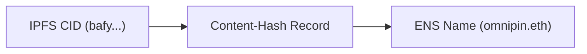

# Get Started

## Installation

Omnipin supports one of the these JavaScript runtimes: [Node.js](https://nodejs.org) (20+), [Deno](https://deno.com) (2.2.11+) and [Bun](https://bun.sh).

:::code-group

```bash [npm]
npm i -g omnipin
```

```bash [pnpm]
pnpm i -g omnipin
```

```bash [bun]
bun i -g omnipin
```

```bash [deno]
deno install --global --allow-read --allow-env --allow-write --allow-net npm:omnipin
```

:::


## IPFS provider setup

### Initial deployment

The first step is setting up content storage providers to deploy the web application to. The full list is available with detailed instructions on the ["IPFS" page](/docs/ipfs). Filecoin will be used as an example because it allows permissionless uploads.

Storage on Filecoin requires FIL and USDfc for payment. In this tutorial, the Filecoin calibration testnet will be used.

Create a new Ethereum private key:

```bash [Terminal]
cast wallet new
```

Save the private key to the `OMNIPIN_FILECOIN_TOKEN` variable.

Request testnet FIL from [this faucet](https://forest-explorer.chainsafe.dev/faucet/calibnet) and USDFc from [another faucet](https://forest-explorer.chainsafe.dev/faucet/calibnet_usdfc) on a freshly created account.

Omnipin is now ready to deploy your app on IPFS.

Run `omnipin deploy` (will deploy `dist` directory by default) with the arguments below to make sure the testnet is used:

```bash [Terminal]
omnipin deploy --providers=Filecoin --filecoin-chain=calibration
```

```bash
🟢 Deploying with providers: Filecoin
📦 Packing dist (4.43MB)
🟢 Root CID: bafybeig2rerivrgw6y2bbh65hib2fxicmc7te4xygakkln4foocprcppeq
✓ [>>>>>>>>>>>>>>>>>>>>>>>>>>>>>>>>>>>>>>>>>>>>>>>>>>>>] Finished in 12s
✔ Deployed across all providers

# ...Filecoin logs

Open in a browser:
IPFS:      https://bafybeig2rerivrgw6y2bbh65hib2fxicmc7te4xygakkln4foocprcppeq.ipfs.dweb.link
Providers: https://delegated-ipfs.dev/routing/v1/providers/bafybeig2rerivrgw6y2bbh65hib2fxicmc7te4xygakkln4foocprcppeq
```

### Pin to other providers

Uploading a website to a single IPFS provider doesn't guarantee decentralization or censorship resistance. It is recommended to pin to at least 1-2 more IPFS providers.

Adding more IPFS providers is as easy as adding an API token, for example for [Pinata](https://pinata.cloud) it would be `OMNIPIN_PINATA_TOKEN`.

For a full list of supported IPFS providers, refer to the ["IPFS" page](/docs/ipfs).

## ENS Updates

Omnipin directly integrates with [ENS](https://ens.domains) (Ethereum Name Service).

Similarly to how DNS is used for websites to not expose raw IP addresses and be more human-friendly, ENS serves the same purpose for content hashes, for example IPFS CIDs.



Automatic ENS updates are as easy as supplying an extra CLI argument during deploy, and adding a name manager's private key to `.env`:

:::danger
Using a private key of the ENS name manager account has immediate security risks. Consider [Safe MFA setup](#mfa-with-safe) instead.
:::
```sh [.env]
OMNIPIN_PK=<0xensmanagerprivatekeygoeshere>
```

```bash [Terminal]
omnipin deploy --ens omnipin.eth
```

Updating ENS Content-Hash record requires paying a network fee. The fee varies depending on network load.

## Safe integration

Using a private key of the ENS name manager account imposes significant security risks. In case of environment compromise, an attacker is able to update the ENS name to a malicious version.

One of the unique features that Omnipin offers is [Safe](https://safe.global) integration. Instead of EOA managing the ENS name, a multi-signature wallet is put in the front. Such approach allows for advancing security for ENS update pipelines, such as multi-factor authorisation with the [Proposer Flow](/docs/how-it-works#proposer) or role-based permissions with [Zodiac Roles](/docs/how-it-works#zodiac-roles).

Proposer flow requires additional factor of authorisation on every deploy, which might be excessive for some websites, especially those with frequent updates. Because of that, the guide will instead cover setup with Zodiac Roles.

1. Head over to the [Safe app](https://app.safe.global) and create a new wallet, if you don't have one yet.

2. Install Safe Zodiac Roles Module through the [Zodiac app](https://app.safe.global/share/safe-app?appUrl=https%3A%2F%2Fzodiac.gnosisguild.org%2F)

3. Generate a JSON for a batch transaction setup via `omnipin zodiac`:

```sh
omnipin zodiac --safe 0x0Fd2cA6b1a52a1153dA0B31D02fD53854627D262 0x6aBD167a6a29Fd9aDcf4365Ed46C71c913B7c1B1

# omnipin zodiac --safe 0x0Fd2cA6b1a52a1153dA0B31D02fD53854627D262 0x6aBD167a6a29Fd9aDcf4365Ed46C71c913B7c1B1 --verbose
# ⚠️ `OMNIPIN_PK` environment variable not set.
# 🟢 Generating a Secp256k1 keypair
#    0xeb12099469558be35d53d606e1d5e69d0854c57ef6658e909325c5a0e6493415
# 🟢 Save the private key and do not share it to anyone
# 🟢 Created zodiac.json in current directory
# Open in a browser: https://app.safe.global/apps/open?safe=:0x0Fd2cA6b1a52a1153dA0B31D02fD53854627D262&appUrl=https%3A%2F%2Fapps-portal.safe.global%2Ftx-builder
# Upload zodiac.json in the UI
```

This will create a `zodiac.json` in a current directory. If `OMNIPIN_PK` is not specified, an Ethereum Account will be generated on the spot.

4. Head over to the Safe [transaction builder](https://app.safe.global/apps/open?appUrl=https%3A%2F%2Fapps-portal.safe.global%2Ftx-builder) page.

5. Drag and drop the JSON file and confirm transaction execution.

6. This will deploy a new Zodiac Roles module address which should be passed during deployment.

Updating ENS is now possible to do within a single command, while maintaining security properties of a Safe.

```sh
omnipin deploy \
    --safe 0xyoursafeAddress \
    omnipin.eth \
    --roles-mod-address 0xyourRolesModAddress
```

Once a transaction finishes getting indexed, the ENS Content-Hash record should start pointing to a new deployment. Now the web app should be discoverable through [any ENS gateway](https://docs.ens.domains/dweb/intro/#browser-support--gateways), for example eth.limo.

## Automation with CI/CD

Omnipin seamlessly integrates with CI/CD pipelines.

All the previous steps can be automated in one GitHub Actions workflow. The workflow deploys a new version on IPFS every time a commit is pushed to the `main` branch and automatically proposes a transaction to Safe.

```yaml
name: Deploy with Omnipin
on:
  push:
    branches: main
jobs:
  deploy:
    runs-on: ubuntu-latest
    steps:
      - uses: actions/checkout@v4
      - uses: oven-sh/setup-bun@v2
      - name: Install Omnipin
        run: bun i -g omnipin@1.2.1
      - name: Build website
        run: bun i && bun run build
      - name: Deploy the site
        run: omnipin deploy .vitepress/dist --strict --ens ${{ vars.OMNIPIN_ENS }} --safe ${{ vars.OMNIPIN_SAFE }} --roles-mod-address ${{ vars.OMNIPIN_ROLES_MOD }}
        env:
          OMNIPIN_PINATA_TOKEN: ${{ secrets.OMNIPIN_PINATA_TOKEN }}
          OMNIPIN_STORACHA_PROOF: ${{ secrets.OMNIPIN_STORACHA_PROOF }}
          OMNIPIN_STORACHA_TOKEN: ${{ secrets.OMNIPIN_STORACHA_TOKEN }}
          OMNIPIN_LIGHTHOUSE_TOKEN: ${{ secrets.OMNIPIN_LIGHTHOUSE_TOKEN }}
          OMNIPIN_4EVERLAND_TOKEN: ${{ secrets.OMNIPIN_4EVERLAND_TOKEN }}
          OMNIPIN_PK: ${{ secrets.OMNIPIN_PK }}
```

The "[CI/CD](/docs/ci-cd)" page describes integrations with other CI/CD providers, such as GitLab Actions.
