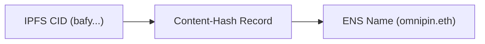

# Get Started

## Installation

Omnipin supports one of these JavaScript runtimes: [Node.js](https://nodejs.org) (20+), [Deno](https://deno.com) (2.2.11+) and [Bun](https://bun.sh).

:::code-group

```bash [npm]
npm i -g omnipin
```

```bash [pnpm]
pnpm i -g omnipin
```

```bash [bun]
bun i -g omnipin
```

```bash [deno]
deno install --global --allow-read --allow-env --allow-write --allow-net npm:omnipin
```

:::


## IPFS provider setup

### Initial deployment

The first step is setting up content storage providers to deploy the web application to. The full list is available with detailed instructions on the ["IPFS" page](/docs/ipfs). Filecoin will be used as an example because it allows permissionless uploads.

Storage on Filecoin requires FIL and USDfc for payment. In this tutorial, the Filecoin calibration testnet will be used.

Create a new Ethereum private key:

```bash [Terminal]
cast wallet new
```

Save the private key to the `OMNIPIN_FILECOIN_TOKEN` variable.

Request testnet FIL from [this faucet](https://forest-explorer.chainsafe.dev/faucet/calibnet) and USDfc from [another faucet](https://forest-explorer.chainsafe.dev/faucet/calibnet_usdfc) on a freshly created account.

Omnipin is now ready to deploy your app on IPFS.

Run `omnipin deploy` (will deploy `dist` directory by default) with the arguments below to make sure the testnet is used:

```bash [Terminal]
omnipin deploy --providers=Filecoin --filecoin-chain=calibration
```

```bash
🟢 Deploying with providers: Filecoin
📦 Packing dist (4.43MB)
🟢 Root CID: bafybeig2rerivrgw6y2bbh65hib2fxicmc7te4xygakkln4foocprcppeq
✓ [>>>>>>>>>>>>>>>>>>>>>>>>>>>>>>>>>>>>>>>>>>>>>>>>>>>>] Finished in 12s
✔ Deployed across all providers

# ...Filecoin logs

Open in a browser:
IPFS:      https://bafybeig2rerivrgw6y2bbh65hib2fxicmc7te4xygakkln4foocprcppeq.ipfs.dweb.link
Providers: https://delegated-ipfs.dev/routing/v1/providers/bafybeig2rerivrgw6y2bbh65hib2fxicmc7te4xygakkln4foocprcppeq
```

### Pin to other providers

Uploading a website to a single IPFS provider doesn't guarantee decentralization or censorship resistance. It is recommended to pin to at least 1-2 more IPFS providers.

Adding more IPFS providers is as easy as adding an API token, for example for [Pinata](https://pinata.cloud) it would be `OMNIPIN_PINATA_TOKEN`.

For a full list of supported IPFS providers, refer to the ["IPFS" page](/docs/ipfs).

## ENS Updates

Omnipin directly integrates with [ENS](https://ens.domains) (Ethereum Name Service).

Similarly to how DNS is used for websites to not expose raw IP addresses and be more human-friendly, ENS serves the same purpose for content hashes, for example IPFS CIDs.


```mermaid
graph LR
    ENS["ENS Name (omnipin.eth)"]
    CH["Content-Hash Record"]
    IPFS["IPFS CID (bafy...)"]

    CH --> ENS
    IPFS --> CH
```

Automatic ENS updates are as easy as supplying an extra CLI argument during deploy, and adding a name manager's private key to `.env`:

:::danger
Using a private key of the ENS name manager account has immediate security risks. Consider [Safe integration](#safe-integration) instead.
:::
```sh [.env]
OMNIPIN_PK=<0xensmanagerprivatekeygoeshere>
```

```bash [Terminal]
omnipin deploy --ens omnipin.eth
```

Updating ENS Content-Hash record requires paying a network fee. The fee varies depending on network load.

## Safe integration

Using a private key of the ENS name manager account imposes significant security risks. In case of environment compromise, an attacker is able to update the ENS name to a malicious version.

One of the unique features that Omnipin offers is [Safe](https://safe.global) integration. Instead of EOA managing the ENS name, a multi-signature wallet is put in the front. Such an approach allows for advanced security for ENS update pipelines, such as multi-factor authorisation with the [Delegate Flow](/docs/how-it-works#delegate) or role-based permissions with [Zodiac Roles](/docs/how-it-works#zodiac-roles).

The recommended setup is the **Delegate Flow**: a dedicated EOA (the *delegate*) signs and proposes a transaction to the Safe Transaction Service, and other Safe owners then confirm and execute it from the Safe UI. The delegate key still needs to be present as `OMNIPIN_PK` — but unlike the EOA-only setup, this key cannot update ENS on its own; it can only suggest transactions for the Safe to approve.

1. Head over to the [Safe app](https://app.safe.global) and create a new Safe (or use an existing one) that owns the ENS name.

2. In the Safe settings, add a **delegate** — typically a fresh EOA created just for deployments. Save its private key as `OMNIPIN_PK`.

3. Run the deploy with `--safe`:

```sh
omnipin deploy --ens omnipin.eth --safe eth:0xyoursafeAddress
```

This will propose a transaction to the Safe Transaction Service. Other Safe owners will then see the pending transaction in the Safe UI and confirm/execute it. Once executed and indexed, the ENS Content-Hash record points to the new deployment, and the site is reachable through [any ENS gateway](https://docs.ens.domains/dweb/intro/#browser-support--gateways) such as eth.limo.

::: tip Zodiac Roles
For high-frequency deploys where requiring a confirmation on every push is excessive, Omnipin also supports submitting transactions directly onchain through a [Zodiac Roles](/docs/how-it-works#zodiac-roles) module with a restricted role. See [`omnipin zodiac`](/cli/zodiac) and the `--roles-mod-address` flag for setup.
:::

## Automation with CI/CD

Omnipin seamlessly integrates with CI/CD pipelines.

All the previous steps can be automated in one GitHub Actions workflow. The workflow deploys a new version on IPFS every time a commit is pushed to the `main` branch and automatically proposes a transaction to Safe.

```yaml
name: Deploy with Omnipin
on:
  push:
    branches: main
jobs:
  deploy:
    runs-on: ubuntu-latest
    steps:
      - uses: actions/checkout@v4
      - uses: oven-sh/setup-bun@v2
      - name: Install Omnipin
        run: bun i -g omnipin
      - name: Build website
        run: bun i && bun run build
      - name: Deploy the site
        run: omnipin deploy .vitepress/dist --strict --ens ${{ vars.OMNIPIN_ENS }} --safe ${{ vars.OMNIPIN_SAFE }}
        env:
          OMNIPIN_PINATA_TOKEN: ${{ secrets.OMNIPIN_PINATA_TOKEN }}
          OMNIPIN_LIGHTHOUSE_TOKEN: ${{ secrets.OMNIPIN_LIGHTHOUSE_TOKEN }}
          OMNIPIN_4EVERLAND_TOKEN: ${{ secrets.OMNIPIN_4EVERLAND_TOKEN }}
          OMNIPIN_PK: ${{ secrets.OMNIPIN_PK }}
```

The "[CI/CD](/docs/ci-cd)" page describes integrations with other CI/CD providers, such as GitLab Actions.
